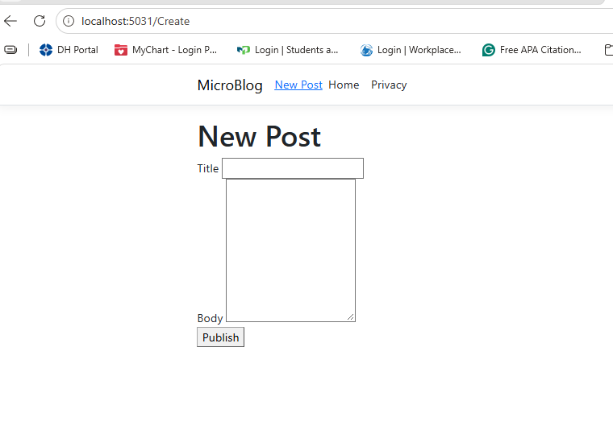
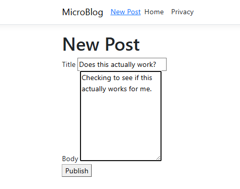
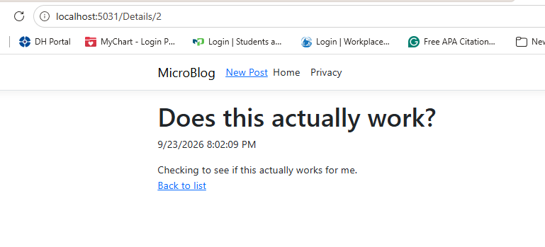

# MicroBlog

This is a simple blog app I built for my ASP.NET class using Razor Pages. It lets you create posts, see them all listed on the home page, and click into a single post to read the full thing. Instead of using a database, posts get saved to a JSON file on disk, so they stick around even after you restart the app.

## What it does

- Add a new post with a title and body
- See all posts on the home page, newest ones first
- Click a post to view it by itself
- Posts save to `data/posts.json` so nothing gets lost when you close the app
- Same navbar/layout on every page
- Post previews on the home page use a shared `_PostCard` partial instead of repeating the same HTML

## Built with

- ASP.NET Core Razor Pages (.NET 9)
- System.Text.Json to read/write the posts file

## How to run it
```
git clone https://github.com/alminett1/MicroBlog.git
cd MicroBlog
dotnet restore
dotnet run
```

Then open whatever URL shows up in the terminal (something like `https://localhost:5031`).

## Screenshots

### Home page


### Create post form


### Single post view


## Where things live

- `Models/Post.cs` – the Post model
- `Services/PostStore.cs` – loads/saves posts to the JSON file
- `Pages/Index.cshtml` – lists all posts
- `Pages/Create.cshtml` – form for adding a post
- `Pages/Details.cshtml` – single post view
- `Pages/Shared/_Layout.cshtml` – shared layout and navbar
- `Pages/Shared/_PostCard.cshtml` – reusable post preview